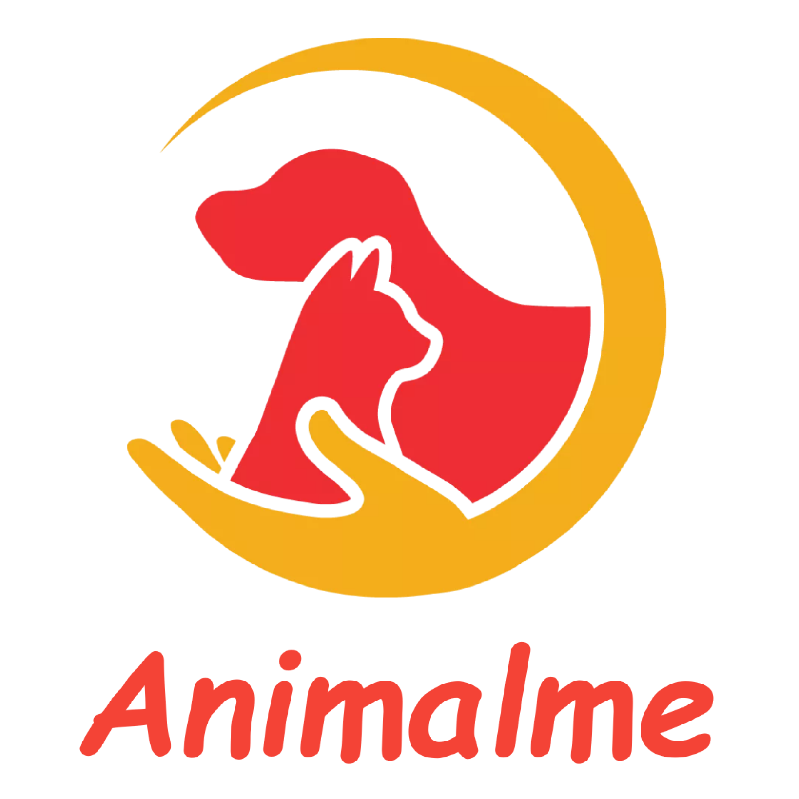

# AnimalMe — Aplicación de adopción de animales

AnimalMe es un proyecto desarrolado con **Springboot**, **Angular** y **AndroidStudio** pensado como la base para construir una aplicacion completa de adopcion y seguimiento de animales y refugios.

<p align="center">
  
</p>
 
---

 ## Requisitos previos

Antes de instalar el proyecto, asegúrate de tener instalado:

- MySQL
- Node.js
- Java 25
- Android Studio

Puedes verificar tus versiones con:

```bash
node -v
java -version
```
##
Crear una base de datos en MySQL para la apliacación
```bash
CREATE DATABASE AnimalMe;
```
##
También tener instalado Angular17

```bash
npm install
npm install -g @angular/cli@17
```
---
## Ejecutar la aplicación

Para ejecutar la aplicación hay que poner el siguiente comando:
```bash
ng serve --open
```
