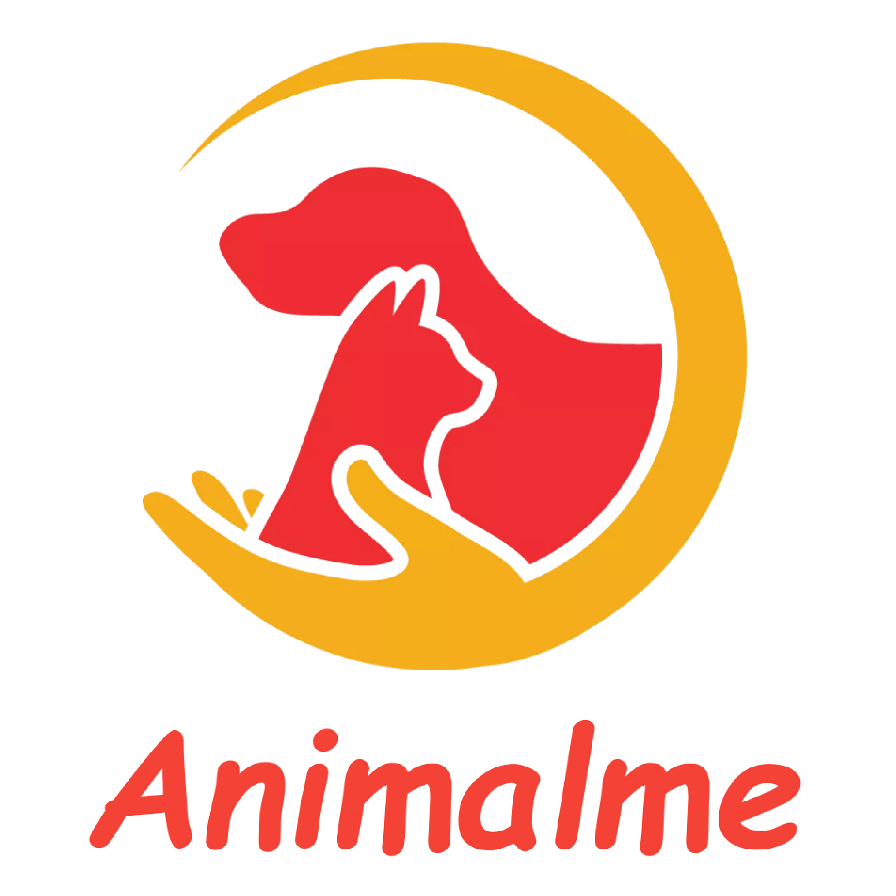

# AnimalMe — Aplicación de adopción de animales

AnimalMe es un proyecto desarrolado con **Springboot**, **Angular** y **AndroidStudio** pensado como la base para construir una aplicacion completa de adopcion y seguimiento de animales y refugios.

<p align="center">
  
</p>
 
 
---
## Trello
 Trello del proyecto, donde se organiza el backlog:
 
 https://trello.com/b/moh6EA5i/animalme
 
 
---

 ## Requisitos previos

Antes de instalar el proyecto, asegúrate de tener instalado:

- MySQL
- Node.js
- Java 21
- Docker
- Android Studio (Para crear el APK)

Puedes verificar tus versiones con:

```bash
node -v
java -version
```
##
Crear una base de datos en MySQL para la apliacación
```bash
CREATE DATABASE AnimalMe;
```
##
También tener instalado Angular17

```bash
npm install
npm install -g @angular/cli@17
```
---
## Ejecutar con Docker

Para ejecutar con docker, dentro de la carpeta raíz hay que abrir una terminal y ejecutar lo siguiente:
```bash
docker compose up --build
```

---
## Ejecutar localmente

Para ejecutar localmente primero tendrás que asegurarte de tener creada la base de datos de AnimalMe y poner la configuración de la base de datos dentro de api/src/main/resources/application.properties
Cuando la tengas, solo necesitarás iniciar con algun IDE que soporte Springboot la carpeta api.

Luego para abrir la pagina web solo necesitas colocarte dentro de la carpeta frontend y ejecutar este comando en la terminal:
```bash
ng serve --open
```
